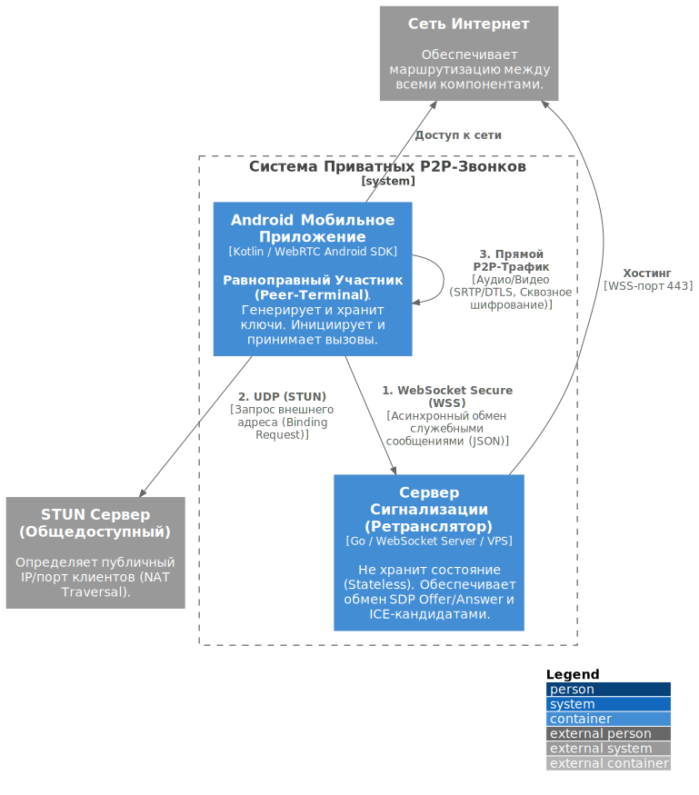
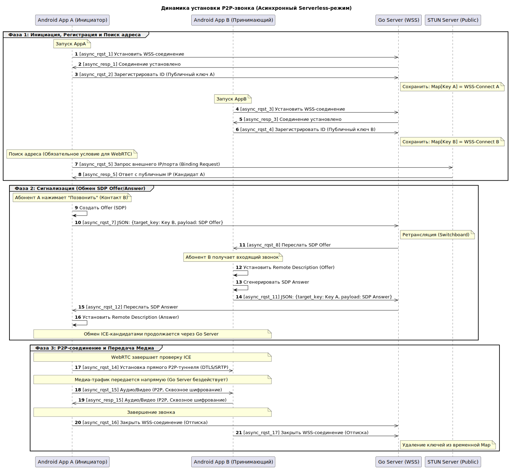
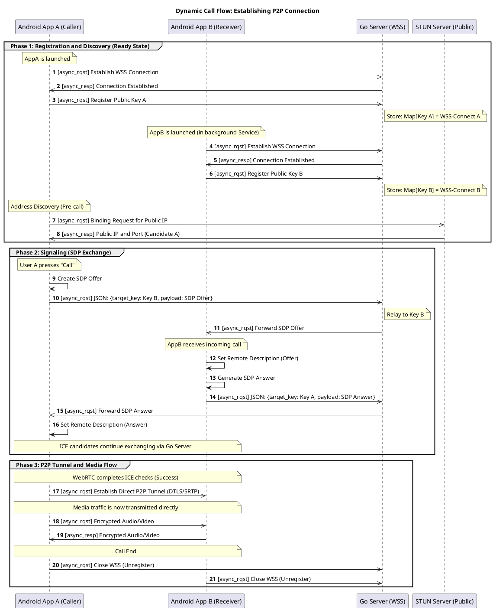

# 🏗️ Foggy Call Architecture

This document details the static and dynamic structure of the **Foggy Call** system. The architecture is designed to enforce maximum user privacy by minimizing the server's role in the communication path, aligning with our 'traceless' design philosophy.

## 1. Architectural Goals and Constraints

| Goal / Constraint | Description | Status |
| :--- | :--- | :--- |
| **P1: Privacy by Design** | No logging or persistent storage of communication metadata on the signaling server. | **Mandatory** |
| **P2: End-to-End Encryption** | All media streams must be encrypted (DTLS/SRTP). | **Mandatory** |
| **C1: Serverless Media** | The signaling server **must not** relay media traffic (no TURN). This prioritizes privacy over 100% connection reliability. | **Mandatory Trade-off** |
| **C2: Server Role** | The Go Server must be **stateless** and act only as a transient message switchboard. | **Mandatory** |
| **G1: Peer-to-Peer Focus** | Prioritize direct P2P connection attempts exclusively. | **Mandatory** |

---

## 2. Static Architecture (Container Diagram)

This diagram identifies the core components (containers) within the system and their logical responsibilities using the C4 Model notation.



```plantuml
@startuml Architecture_Static_Diagram_Updated
!include [https://raw.githubusercontent.com/plantuml-stdlib/C4-PlantUML/master/C4_Container.puml](https://raw.githubusercontent.com/plantuml-stdlib/C4-PlantUML/master/C4_Container.puml)

LAYOUT_WITH_LEGEND()

System_Boundary(C4_Sys, "Foggy Call System (Private P2P Voice/Video)") {
    
    Container(AndroidApp, "Android Mobile Application", "Kotlin / WebRTC Android SDK", "**Peer-Terminal**. Manages key cryptography, signaling, and media streams. Initiates and receives calls.")
    
    Container(GoServer, "Signaling Server (Relay)", "Go / WebSocket Server (WSS) / VPS", "Stateless, log-free switchboard. Relays transient SDP Offer/Answer and ICE candidates.")
}

System_Ext(STUNServer, "STUN Server (Public)", "UDP", "Identifies the client's public IP/port for NAT Traversal.")
System_Ext(Internet, "The Internet", "TCP/UDP", "Provides routing and connectivity between all nodes.")
Rel(AndroidApp, GoServer, "1. WebSocket Secure (WSS)", "Asynchronous exchange of signaling messages (JSON)")
Rel(AndroidApp, STUNServer, "2. UDP (STUN)", "Binding Request for external address resolution")
Rel(AndroidApp, AndroidApp, "3. Direct P2P Traffic", "Encrypted Audio/Video (SRTP/DTLS)")

Rel_U(GoServer, Internet, "Hosting/Connectivity", "WSS Port 443")
Rel_U(AndroidApp, Internet, "Network Access")

@enduml
```

| Component | Responsibility | Technology |
| :--- | :--- | :--- |
| Android Mobile Application | "Manages the full lifecycle of a call, from key generation and registration to media transmission.  | Must maintain an active WSS connection (Ready State) via an Android Service.","Kotlin, WebRTC Android SDK, Android Keystore" |
| Go Signaling Server | Acts as a temporary lookup service (Public Key -> WSS Connection).  | Its only task is to route signaling messages between registered peers.,"Go, WebSockets" |
| STUN Server | Essential for WebRTC to overcome basic NATs and firewalls by discovering the client's public network identity.  | UDP Protocol |

---

## 3. Dynamic Architecture (Sequence Diagram)

This diagram illustrates the step-by-step process required for App A to establish a secure P2P connection with App B.




